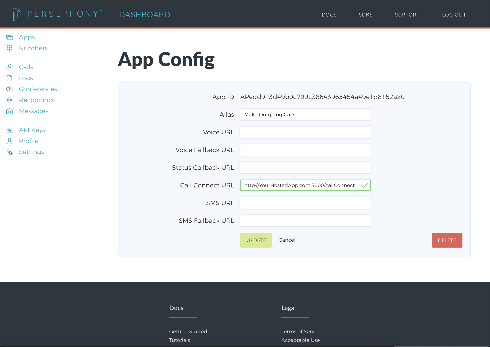

# Making Outgoing Calls Application

This project serves as a guide to help you build an application with Persephony. Specifically, the project will:

- Create an outgoing call to the user's phone number from the Persephony phone number and play a message for the user.

## Setting up your new app within your Persephony account

1. After logging into your Persephony account, we will [Get a Persephony Phone Number](https://www.persephony.com/dashboard/portal/numbers/buy). Users will be receiving calls from this phone number.
2. Next, create a new app using the [Create New App form](https://www.persephony.com/dashboard/portal/applications/new).

   When a HTTP Request is sent to our app, Persephony will create a new call to the user and then issue an HTTP Request to your application at a given url.

   The app's alias for this tutorial is Make Outgoing Call. This tutorial will use the `Call Connect URL` (with endpoint `/callConnect`).
   

3. Next, link your Persephony number to your Persephony app. Go to the [My Numbers page](https://www.persephony.com/dashboard/portal/numbers) and click on the number you purchased in Step 1. Set the app to your new Make Outgoing Calls Application.
   

## Setting up the Movie Quote Application locally

1. Clone or download this repo locally. To further understand the processes in this application, additional reading can be found in the [Getting Started Tutorial](https://persephony-docs.readme.io/docs/getting-started-with-persephony).
2. Install the node packages necessary using command:

   ```bash
   yarn install
   ```

3. Configure environment variables (this tutorial uses the [dotenv package](https://www.npmjs.com/package/dotenv)).

   | ENV VARIABLE            | DESCRIPTION                                                                                                                                                                   |
   | ----------------------- | ----------------------------------------------------------------------------------------------------------------------------------------------------------------------------- |
   | ACCOUNT_ID              | Account ID which can be found under [API Keys](https://www.persephony.com/dashboard/portal/account/authentication) in Dashboard                                               |
   | AUTH_TOKEN              | Authentication Token which can be found under [API Keys](https://www.persephony.com/dashboard/portal/account/authentication) in Dashboard                                     |
   | PERSEPHONY_PHONE_NUMBER | Persephony Phone Number associated with Movie Quote Application found under [My Numbers](https://www.persephony.com/dashboard/portal/numbers) in Dashboard (**E.164 format**) |
   | PERSEPHONY_APP_ID       | Application ID associated with Persephony Movie Quote Application found under [Apps](https://www.persephony.com/dashboard/portal/applications) in Dashboard                   |

## Using the Movie Quote Application

### Responding to Incoming Calls and Texts

1. Run the application using command:

   ```bash
   $ node index
   Running the application on port 3000.
   ```

2. Hit the /sendCall endpoint with the E.164 formatted phone number that should receive the call (`destination_phone_number`) in the body of the request.

   ```bash
   curl -XPOST http://YourHostedApp.com/sendCall -d '{"destination_phone_number":"+1XXXXXXXXXX"}' -H "Content-Type: application/json"
   ```

3. Expect a call from your Persephony phone number to be made to the phone number provided in the request, then the message created in the /callConnect should be played within the phone call.
